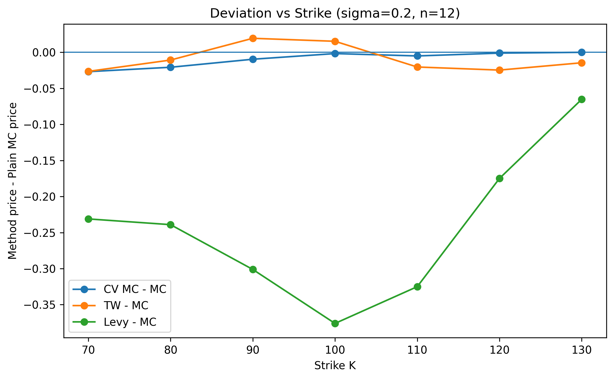
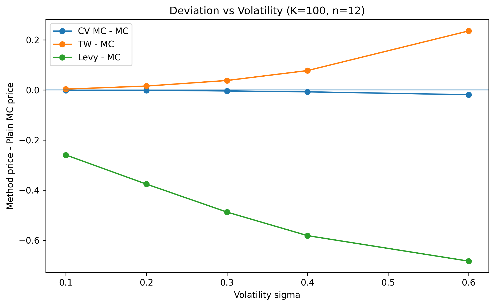
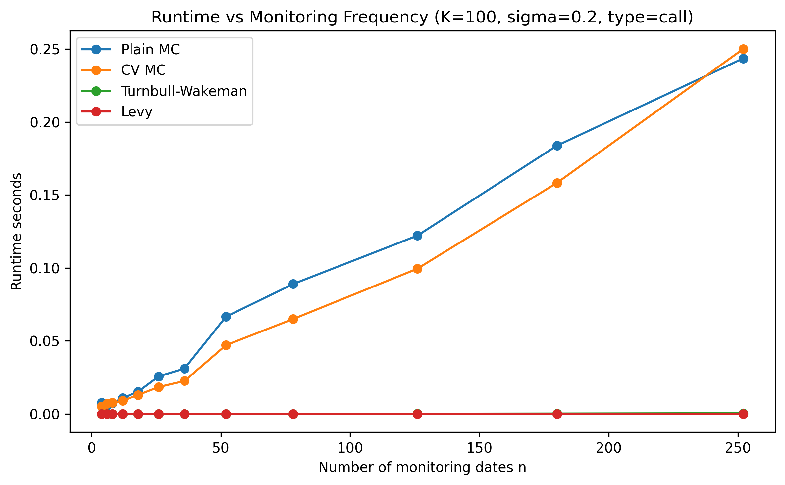
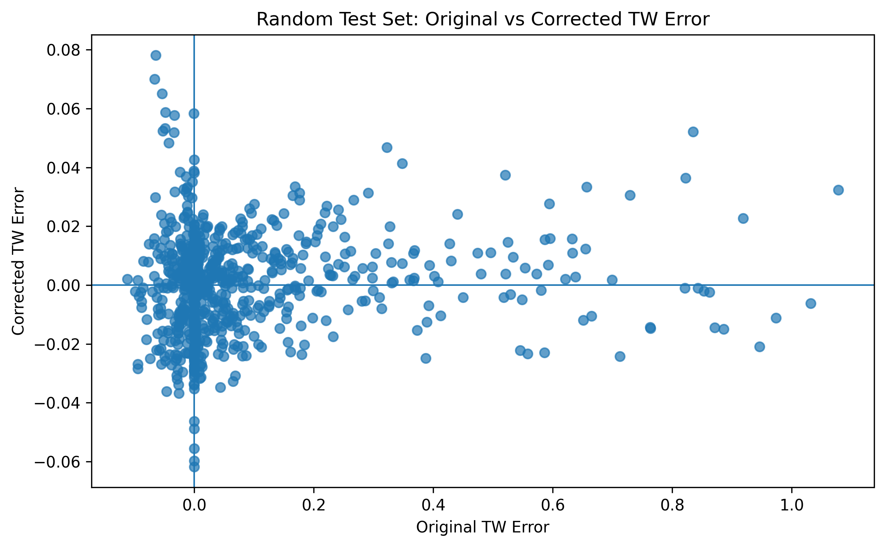
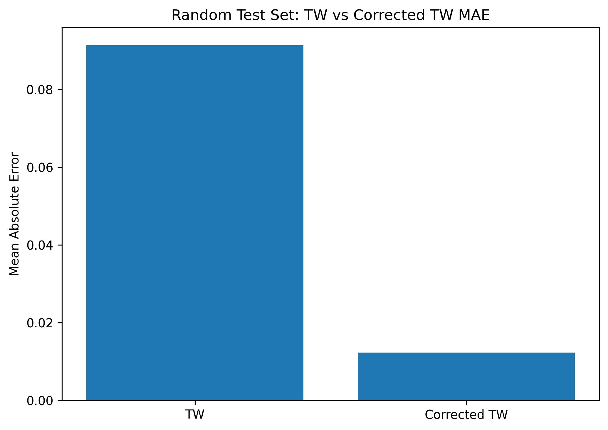
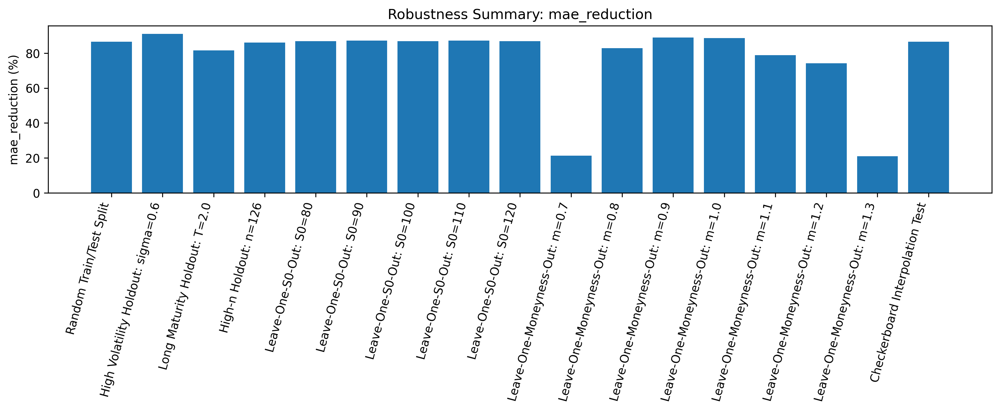

# Bias-Corrected Turnbull-Wakeman Approximation for Arithmetic Asian Options

This project studies the pricing of arithmetic Asian options under the Black-Scholes geometric Brownian motion framework. Since arithmetic Asian options do not admit a simple closed-form solution, the project compares Monte Carlo methods, analytical approximations, stochastic-volatility extensions, and data-driven residual correction approaches.

The main goal is to build a pricing framework that keeps the speed of analytical approximations while improving their accuracy relative to high-precision Monte Carlo benchmarks.

---

## Installation

The package is available on PyPI:

```bash
pip install asianoption
```

After installation, the package can be imported as:

```python
import asianoption
```

---

## Quick Start

### Constant-Volatility GBM Asian Option Pricing

The package supports pricing arithmetic Asian options under the constant-volatility GBM setting using:

- Turnbull-Wakeman approximation
- Plain Monte Carlo
- Control variate Monte Carlo

By default, the averaging window is the standard academic setting \([0,T]\).  
The same functions also support a flexible averaging window \([T_1,T_2]\) through the optional arguments `averaging_start` and `averaging_end`.

```python
from asianoption import (
    turnbull_wakeman_arithmetic_asian_price,
    arithmetic_asian_price_mc,
    arithmetic_asian_cv,
)

S0 = 100
K = 100
r = 0.05
sigma = 0.2
T = 1.0
n = 12

# ------------------------------------------------------------
# Standard Asian option: averaging over [0, T]
# ------------------------------------------------------------
tw_price = turnbull_wakeman_arithmetic_asian_price(
    S0=S0,
    K=K,
    r=r,
    sigma=sigma,
    T=T,
    n=n,
    option_type="call",
)

mc_price, mc_se = arithmetic_asian_price_mc(
    S0=S0,
    K=K,
    r=r,
    T=T,
    sigma=sigma,
    n=n,
    n_paths=100_000,
    seed=42,
    option_type="call",
)

cv_result = arithmetic_asian_cv(
    S0=S0,
    K=K,
    r=r,
    T=T,
    sigma=sigma,
    n=n,
    n_paths=100_000,
    seed=42,
    option_type="call",
)

print("Standard averaging over [0, T]")
print("Turnbull-Wakeman price:", tw_price)
print("Plain MC price:", mc_price)
print("Plain MC standard error:", mc_se)
print("Control Variate MC price:", cv_result.price)
print("Control Variate MC standard error:", cv_result.std_error)
print("Variance reduction:", cv_result.variance_reduction)


# ------------------------------------------------------------
# Delayed-start Asian option: averaging over [T1, T2]
# ------------------------------------------------------------
averaging_start = 0.5
averaging_end = 1.0

tw_delayed = turnbull_wakeman_arithmetic_asian_price(
    S0=S0,
    K=K,
    r=r,
    sigma=sigma,
    T=T,
    n=n,
    option_type="call",
    averaging_start=averaging_start,
    averaging_end=averaging_end,
)

mc_delayed, mc_delayed_se = arithmetic_asian_price_mc(
    S0=S0,
    K=K,
    r=r,
    T=T,
    sigma=sigma,
    n=n,
    n_paths=100_000,
    seed=42,
    option_type="call",
    averaging_start=averaging_start,
    averaging_end=averaging_end,
)

cv_delayed = arithmetic_asian_cv(
    S0=S0,
    K=K,
    r=r,
    T=T,
    sigma=sigma,
    n=n,
    n_paths=100_000,
    seed=42,
    option_type="call",
    averaging_start=averaging_start,
    averaging_end=averaging_end,
)

print("\nDelayed averaging over [0.5, 1.0]")
print("Delayed Turnbull-Wakeman price:", tw_delayed)
print("Delayed Plain MC price:", mc_delayed)
print("Delayed Plain MC standard error:", mc_delayed_se)
print("Delayed Control Variate MC price:", cv_delayed.price)
print("Delayed Control Variate MC standard error:", cv_delayed.std_error)
```
---

### Stochastic Volatility Examples

The package also includes arithmetic Asian option pricing under Heston and SABR stochastic volatility models.

```python
from asianoption import (
    arithmetic_asian_heston_mc,
    arithmetic_asian_sabr_mc,
    turnbull_wakeman_heston_effective_vol_price,
    turnbull_wakeman_sabr_effective_vol_price,
)

heston_mc = arithmetic_asian_heston_mc(
    S0=100,
    K=100,
    r=0.05,
    T=1.0,
    v0=0.04,
    kappa=2.0,
    theta=0.04,
    xi=0.3,
    rho=-0.7,
    n=12,
    n_paths=100_000,
    seed=42,
    option_type="call",
)

heston_tw = turnbull_wakeman_heston_effective_vol_price(
    S0=100,
    K=100,
    r=0.05,
    T=1.0,
    v0=0.04,
    kappa=2.0,
    theta=0.04,
    xi=0.3,
    rho=-0.7,
    n=12,
    option_type="call",
)

sabr_mc = arithmetic_asian_sabr_mc(
    F0=100,
    K=100,
    r=0.05,
    T=1.0,
    alpha0=0.2,
    beta=1.0,
    nu=0.3,
    rho=-0.4,
    n=12,
    n_paths=100_000,
    seed=42,
    option_type="call",
)

sabr_tw = turnbull_wakeman_sabr_effective_vol_price(
    S0=100,
    K=100,
    r=0.05,
    T=1.0,
    alpha0=0.2,
    beta=1.0,
    nu=0.3,
    rho=-0.4,
    n=12,
    option_type="call",
)

print("Heston Asian MC price:", heston_mc.price)
print("Heston effective-vol TW price:", heston_tw)

print("SABR Asian MC price:", sabr_mc.price)
print("SABR effective-vol TW price:", sabr_tw)
```

---

## Available Methods

| Method | Description |
|---|---|
| Plain Monte Carlo | Simulates GBM paths and prices arithmetic Asian options by discounted payoff averaging. |
| Control Variate Monte Carlo | Uses the geometric Asian option as a control variate to reduce Monte Carlo variance. |
| Geometric Asian Closed Form | Analytical benchmark for geometric Asian options under GBM. |
| Geometric Asian Monte Carlo | Monte Carlo pricing for geometric Asian options. |
| Turnbull-Wakeman Approximation | Fast moment-matching analytical approximation for arithmetic Asian options under GBM. |
| Levy Approximation | Continuous-time approximation for arithmetic Asian options. |
| Heston Asian Monte Carlo | Prices arithmetic Asian options under Heston stochastic volatility. |
| SABR Asian Monte Carlo | Prices arithmetic Asian options under spot-style SABR stochastic volatility. |
| Heston Effective-Vol TW Baseline | Uses expected average Heston variance as an effective volatility inside the Turnbull-Wakeman approximation. |
| SABR Effective-Vol TW Baseline | Uses initial SABR local log-volatility as an effective volatility inside the Turnbull-Wakeman approximation. |

---

## Development Install

To run the research scripts and notebooks from the GitHub repository:

```bash
git clone https://github.com/RyanHou0303/AsianOption.git
cd AsianOption
pip install -e .
```

This installs the package in editable mode together with the required dependencies specified in `pyproject.toml`.

Example scripts:

```bash
python experiments/greeks_robustness_check.py
python experiments/stochastic_bias_correction.py
python scripts/build_stochastic_residual_dataset.py
```

To run demo notebooks, install Jupyter if needed:

```bash
pip install jupyter
```

---
## 1. Motivation

Asian options depend on the average price of the underlying asset over time. For a discretely monitored arithmetic Asian call option, the arithmetic average is

$$
A = \frac{1}{n}\sum_{i=1}^{n} S_{t_i}.
$$

The call payoff is

$$
\max(A-K,0) = (A-K)^+.
$$

Unlike geometric Asian options, arithmetic Asian options do not have a simple closed-form pricing formula. This creates a practical trade-off:

- Plain Monte Carlo is flexible but computationally expensive.
- Control variate Monte Carlo is more accurate but still simulation-based.
- Analytical approximations such as Turnbull-Wakeman are fast but can have systematic bias.

This project investigates whether the bias of a fast approximation can be learned and corrected.

---

## 2. Project Structure

```text
AsianOption/
│
├── asianoption/
│   ├── __init__.py
│   │   └── Public API exports for pricing, approximation, stochastic-volatility, and TW baseline functions
│   │
│   ├── arithmetic_asian_MC.py
│   │   └── Plain Monte Carlo pricing for arithmetic Asian options under GBM
│   │
│   ├── geometric_asian.py
│   │   └── Geometric Asian option Monte Carlo and closed-form pricing
│   │
│   ├── control_variate.py
│   │   └── Arithmetic Asian Monte Carlo with geometric Asian control variate
│   │
│   ├── approximation.py
│   │   └── Turnbull-Wakeman and Levy analytical approximations
│   │
│   ├── stochastic_volatility.py
│   │   └── Heston and SABR Monte Carlo pricing for arithmetic Asian options
│   │
│   ├── stochastic_tw.py
│   │   └── Effective-volatility Turnbull-Wakeman baselines for Heston and SABR
│   │
│   └── utils.py
│       └── Shared helper functions
│
├── scripts/
│   ├── build_residual_dataset.py
│   │   └── Generate the GBM Turnbull-Wakeman residual dataset
│   │
│   └── build_stochastic_residual_dataset.py
│       └── Generate Heston and SABR residual datasets
│
├── experiments/
│   ├── compare_methods.py
│   │   └── Compare plain MC, control variate MC, TW, and Levy methods
│   │
│   ├── K_sigma_study.py
│   │   └── Study pricing deviations across strike and volatility
│   │
│   └── greeks_comparison.py
│       └── Single-case finite-difference Greek comparison against CV Monte Carlo Greeks
│
├── model_comparison/
│   ├── TW_bias_correction.py
│   │   └── Train and evaluate the GBM TW residual correction model
│   │
│   ├── robustness_check_for_TW_bias_correction.py
│   │   └── Robustness tests for the GBM residual correction model
│   │
│   ├── robustness_check_for_greeks.py
│   │   └── Greek robustness tests across moneyness, volatility, maturity, and monitoring frequency
│   │
│   ├── stochastic_bias_correction.py
│   │   └── Train Heston and SABR residual correction models
│   │
│   └── alternative_method_interpolation.py
│       └── Compare polynomial Ridge correction with cubic interpolation correction
│
├── tests/
│   ├── test_imports.py
│   │   └── Tests public package imports
│   │
│   ├── test_gbm_pricing.py
│   │   └── Tests GBM pricing functions and control variate variance reduction
│   │
│   └── test_stochastic_volatility.py
│       └── Tests Heston, SABR, and effective-volatility helper functions
│
├── notebooks/
│   └── demo_bias_corrected_tw_with_plots_colab_ready.ipynb
│       └── Colab-ready demo notebook with pricing comparisons, residual correction, stochastic-volatility examples, and Greek diagnostics
│
├── data/
│   ├── tw_residual_dataset_s0_grid.csv
│   │   └── GBM residual dataset with multiple spot levels
│   │
│   ├── heston_tw_residual_dataset.csv
│   │   └── Heston effective-volatility TW residual dataset
│   │
│   ├── sabr_tw_residual_dataset.csv
│   │   └── SABR effective-volatility TW residual dataset
│   │
│   ├── bias_correction_summary.csv
│   │   └── Summary of GBM bias-correction performance
│   │
│   └── bias_correction_robustness_summary.csv
│       └── Summary of robustness tests for the GBM correction model
│
├── reports/
│   ├── greeks_comparison_results.csv
│   │   └── Single-case Greek comparison results
│   │
│   ├── greeks_robustness_summary.csv
│   │   └── Summary of Greek robustness results
│   │
│   ├── stochastic_bias_correction_summary.csv
│   │   └── Summary of Heston and SABR residual correction results
│   │
│   ├── heston_stochastic_correction_test_results.csv
│   │   └── Prediction-level Heston correction test results
│   │
│   └── sabr_stochastic_correction_test_results.csv
│       └── Prediction-level SABR correction test results
│
├── figures/
│   ├── runtime_vs_monitoring_frequency_K100_sigma_0p2.png
│   │   └── Runtime comparison across monitoring frequencies
│   │
│   ├── error_vs_strike_sigma_0p2_n12.png
│   │   └── Pricing deviation versus strike
│   │
│   ├── error_vs_vol_K100_n12.png
│   │   └── Pricing deviation versus volatility
│   │
│   └── robustness_mae_reduction_summary.png
│       └── Robustness summary visualization
│
├── .github/
│   └── workflows/
│       ├── ci.yml
│       │   └── Run tests automatically on GitHub
│       │
│       └── publish.yml
│           └── Publish package to PyPI when a GitHub Release is created
│
├── pyproject.toml
│   └── Package metadata, dependencies, and build configuration
│
├── README.md
│   └── Project documentation
│
├── LICENSE
│   └── MIT license
│
└── .gitignore
    └── Files and folders excluded from version control
```

---

## 3. Models Implemented

### 3.1 Black-Scholes GBM Simulation

The underlying asset follows the risk-neutral geometric Brownian motion model:

$$
dS_t = rS_t\,dt + \sigma S_t\,dW_t.
$$

Equivalently,

$$
\frac{dS_t}{S_t} = r\,dt + \sigma\,dW_t.
$$

The exact solution is

$$
S_t =
S_0
\exp\left[
\left(r-\frac{1}{2}\sigma^2\right)t+\sigma W_t
\right].
$$

For a fixing date $t_i$, this gives

$$S_{t_i} = S_0 \exp\left[ \left(r-\frac{1}{2}\sigma^2\right)t_i+\sigma W_{t_i} \right].$$

---

### 3.2 Plain Monte Carlo

The arithmetic Asian option price is estimated by

$$\text{Price} = e^{-rT} \mathbb{E} \left[ \max(A-K,0) \right].$$

Equivalently,

$$\text{Price} = e^{-rT} \mathbb{E} \left[ (A-K)^+ \right].$$

The plain Monte Carlo estimator is

$$\widehat{V}_{\mathrm{arith}}^{\mathrm{MC}} = e^{-rT} \frac{1}{M} \sum_{j=1}^{M} \left(A^{(j)}-K\right)^+,$$

where $M$ is the number of simulated paths and $A^{(j)}$ is the arithmetic average along path $j$.

Plain Monte Carlo is simple but can have relatively high variance, especially when many benchmark prices are required across a parameter grid.

---

### 3.3 Geometric Asian Closed-Form Formula

The geometric average is

$$G = \left( \prod_{i=1}^{n} S_{t_i} \right)^{1/n}.$$

Under GBM, the logarithm of the geometric average is normally distributed, so the geometric Asian option has a closed-form solution.

The geometric Asian option is used both as:

1. A standalone pricing benchmark for geometric Asian options.
2. A control variate for arithmetic Asian Monte Carlo pricing.

---

### 3.4 Control Variate Monte Carlo

The control variate estimator is defined as

$$V_{\mathrm{CV}} = V_{\mathrm{arith}}^{\mathrm{MC}} - \beta \left( V_{\mathrm{geo}}^{\mathrm{MC}} - V_{\mathrm{geo}}^{\mathrm{closed}} \right).$$

where:

- $V_{\mathrm{arith}}^{\mathrm{MC}}$ is the simulated arithmetic Asian payoff.
- $V_{\mathrm{geo}}^{\mathrm{MC}}$ is the simulated geometric Asian payoff.
- $V_{\mathrm{geo}}^{\mathrm{closed}}$ is the analytical geometric Asian option price.
- $\beta$ is the control variate coefficient.

Before applying the control variate adjustment, we first compute the sample correlation between the arithmetic and geometric discounted payoffs. The high correlation confirms that the geometric Asian payoff is an effective control variate.
The optimal coefficient is

$$\beta^* = \frac{ \mathrm{Cov} \left( V_{\mathrm{arith}}^{\mathrm{MC}}, V_{\mathrm{geo}}^{\mathrm{MC}} \right) }{ \mathrm{Var} \left( V_{\mathrm{geo}}^{\mathrm{MC}} \right) }.$$

Because arithmetic and geometric Asian payoffs are highly correlated, this greatly reduces Monte Carlo variance.

#### Example: Variance Reduction

For the parameter setting

$$S_0 = 100,\quad K = 100,\quad r = 0.05,\quad \sigma = 0.2,\quad T = 1.0,\quad n = 12,$$

the control variate estimator significantly reduces the Monte Carlo standard error.

| Option Type | Plain MC Price | CV Price | Plain MC Std. Error | CV Std. Error | Geometric Asian Closed-Form | Beta | Rho |
|---|---:|---:|---:|---:|---:|---:|---:|
| Call | $6.179168$ | $6.156463$ | $0.012055$ | $0.000338$ | $5.940200$ | $1.0316$ |$0.999606$
| Put | $3.523196$ | $3.534525$ | $0.007849$ | $0.000199$ | $3.651734$ | $0.9761$ |$ 0.999679$

The results show that using the geometric Asian option as a control variate reduces the Monte Carlo variance by more than $1000\times$ for both calls and puts in this example.

The control variate estimator is used as the benchmark price in the residual correction experiments.

---

### 3.5 Turnbull-Wakeman Approximation

The Turnbull-Wakeman approximation is one of the most classic analytical approximation methods used for pricing Asian options.

#### 1. Core Concept

This method uses moment matching to approximate the arithmetic average $A$ as a lognormal random variable $\widetilde{A}$:

$$A \approx \widetilde{A}, \qquad \widetilde{A} \sim \mathrm{Lognormal}(\mu_A,\sigma_A^2).$$

The parameters $\mu_A$ and $\sigma_A^2$ are chosen to match the first two moments of the true arithmetic average:

$$\mathbb{E}[\widetilde{A}] = \mathbb{E}[A], \qquad \mathrm{Var}(\widetilde{A}) = \mathrm{Var}(A).$$

#### 2. Parameter Calculation

Under the lognormal assumption, the parameter $\sigma_A^2$, which is the variance of $\ln \widetilde{A}$ used in the pricing formula, is calculated as

$$\sigma_A^2 = \ln \left( 1+ \frac{ \mathrm{Var}(A) }{ \mathbb{E}[A]^2 } \right).$$

The $\sigma_A^2$ here already incorporates the time dimension, so it represents total log-variance. When calculating $d_1$, the denominator is $\sigma_A$, not $\sigma_A\sqrt{T}$.
#### 3. Pricing Formula

The resulting call option price takes a Black-Scholes-like analytical form:

$$C_{\mathrm{TW}} = e^{-rT} \left( \mathbb{E}[A]\Phi(d_1) - K\Phi(d_2) \right).$$

where

$$d_1 = \frac{ \ln\left(\frac{\mathbb{E}[A]}{K}\right) + \frac{1}{2}\sigma_A^2 }{ \sigma_A }, \qquad d_2 = d_1-\sigma_A.$$

Here, $\Phi(\cdot)$ is the standard normal cumulative distribution function.

#### Example: Pricing Results Across Methods

For the parameter setting

$$S_0 = 100,\quad K = 100,\quad r = 0.05,\quad \sigma = 0.2,\quad T = 1.0,\quad n = 12,$$

the pricing results across different methods are:

| Option Type | Plain MC | Control Variate MC | Turnbull-Wakeman | Levy Approximation | Geometric Asian Closed-Form |
|---|---:|---:|---:|---:|---:|
| Call | $6.179168$ | $6.156463$ | $6.174171$ | $5.782838$ | $5.940200$ |
| Put | $3.523196$ | $3.534525$ | $3.552611$ | $3.364630$ | $3.651734$ |

---
## Figures

### TW Approximation Error vs Strike



### TW Approximation Error vs Volatility



### Runtime vs Monitoring Frequency




## 4. Bias Correction Idea

Although the Turnbull-Wakeman approximation is computationally efficient, it exhibits systematic biases depending on the parameter space. This project uses a penalized regression model to learn and compensate for these systematic errors.

In this project, the residual is defined as the Turnbull-Wakeman approximation minus the control variate benchmark:

$$\varepsilon_{\mathrm{TW}} = C_{\mathrm{TW}} - V_{\mathrm{CV}}.$$

A positive residual means that the Turnbull-Wakeman approximation overprices the option relative to the control variate benchmark. A negative residual means that it underprices the option.

The corrected price is then

$$C_{\mathrm{corrected}} = C_{\mathrm{TW}} - \widehat{\varepsilon}_{\mathrm{TW}}.$$

This approach offers two primary advantages:

1. The analytical approximation already captures most of the option pricing structure.
2. The regression model only needs to learn the remaining systematic approximation error, which is simpler than learning the entire pricing function from scratch.

In essence, the model does not function as a black-box pricer. Instead, it acts as a residual correction layer integrated into a traditional financial approximation framework.

---

### Polynomial Ridge Regression Residual Model

The model learns a mapping from option features to the scaled Turnbull-Wakeman residual:

$$\widehat{y} = f_\theta(x).$$

The base feature vector is

$$x = \left[ \ln\left(\frac{K}{S_0}\right), \ \sigma, \ T, \ \frac{1}{n} \ \right]^\top.$$

To capture nonlinear interactions in the residual surface, the base features are expanded into polynomial features:

$$\phi_d(x) = \left[ 1,\ x_1,\ldots,x_p,\ x_1^2,\ x_1x_2,\ldots,\ x_p^d \right]^\top,$$

where $d$ is the polynomial degree and $p$ is the number of base features.

The Ridge regression model is then fitted in the polynomial feature space:

$$\widehat{y} = \beta_0 + \phi_d(x)^\top \beta.$$

The coefficients are estimated by minimizing the penalized least-squares objective:

$$\min_{\beta_0,\beta} \sum_{i=1}^{N} \left( y_i - \beta_0 - \phi_d(x_i)^\top \beta \right)^2 + \lambda \lVert \beta \rVert_2^2.$$

The intercepts not penalized. The Ridge penalty shrinks the polynomial coefficients and helps reduce overfitting, especially when higher-order interaction terms are included.

After predicting the scaled residual , the unscaled residual estimate is

$$\widehat{\varepsilon}_{\mathrm{TW}} = S_0 \widehat{y}.$$

Since the residual is defined as

$$\varepsilon_{\mathrm{TW}} = C_{\mathrm{TW}} - V_{\mathrm{CV}},$$

the corrected Turnbull-Wakeman price is

$$C_{\mathrm{corrected}} = C_{\mathrm{TW}} - \widehat{\varepsilon}_{\mathrm{TW}}.$$

Equivalently,

$$C_{\mathrm{corrected}} = C_{\mathrm{TW}} - S_0\widehat{y}.$$

### Dataset

The current dataset contains $3360$ parameter combinations.

The grid includes multiple spot levels:

$$S_0 \in \{80,90,100,110,120\}.$$

For each spot level, the strike is generated through a fixed moneyness grid:

$$m = \frac{K}{S_0}, \qquad m \in \{0.7,0.8,0.9,1.0,1.1,1.2,1.3\}.$$

Equivalently,

$$K = S_0m.$$

The dataset also varies maturity, volatility, and monitoring frequency:

$$T \in \{0.25,0.5,1.0,2.0\},$$

$$\sigma \in \{0.1,0.2,0.3,0.4,0.5,0.6\},$$

$$n \in \{12,26,52,126\}.$$

Therefore, the total number of parameter combinations is

$$5 \times 4 \times 7 \times 6 \times 4 = 3360.$$

For each parameter combination, the following quantities are computed:

- Control variate benchmark price $V_{\mathrm{CV}}$
- Turnbull-Wakeman approximation price $C_{\mathrm{TW}}$
- Turnbull-Wakeman residual $\varepsilon_{\mathrm{TW}} = C_{\mathrm{TW}} - V_{\mathrm{CV}}$
- Scaled residual $y = \varepsilon_{\mathrm{TW}} / S_0$
- Option parameters and engineered features

Because the dataset includes multiple spot levels, it can now be used to test scale robustness through leave-one-$S_0$ experiments.

---

## Robustness Check Results

This section evaluates the robustness of the proposed Turnbull-Wakeman bias-correction framework.

The model learns the scale-normalized residual

$$y = \frac{ C_{\mathrm{TW}} - C_{\mathrm{CV}} }{ S_0 },$$

where $C_{\mathrm{TW}}$ is the Turnbull-Wakeman approximation and $C_{\mathrm{CV}}$ is the control-variate Monte Carlo benchmark.

The correction is then applied as

$$C_{\mathrm{corrected}} = C_{\mathrm{TW}} - S_0 \widehat{y}.$$

The model uses the following economically motivated features:

$$\log(K/S_0), \qquad \sigma, \qquad T, \qquad \frac{1}{n}.$$

A third-degree polynomial Ridge regression is used to capture nonlinear interactions while controlling overfitting.

---

### Dataset

The robustness dataset is built on the following parameter grid:

| Parameter | Values |
|---|---|
| Spot $S_0$ | 80, 90, 100, 110, 120 |
| Moneyness $K/S_0$ | 0.7, 0.8, 0.9, 1.0, 1.1, 1.2, 1.3 |
| Volatility $\sigma$ | 0.1, 0.2, 0.3, 0.4, 0.5, 0.6 |
| Maturity $T$ | 0.25, 0.5, 1.0, 2.0 |
| Monitoring dates $n$ | 12, 26, 52, 126 |

Total number of cases:

$$5 \times 7 \times 6 \times 4 \times 4 = 3360.$$

For each parameter combination, the control-variate Monte Carlo price is used as the benchmark.

---

## Main Robustness Summary

| Test | Test Size | Test $R^2$ | Original TW MAE | Corrected TW MAE | MAE Reduction | Improved Cases |
|---|---:|---:|---:|---:|---:|---:|
| Random Train/Test Split | 840 | 0.9912 | 0.091455 | 0.012304 | **86.55%** | 66.90% |
| High Volatility Holdout, $\sigma=0.6$ | 560 | 0.9856 | 0.256846 | 0.022913 | **91.08%** | 93.04% |
| Long Maturity Holdout, $T=2.0$ | 840 | 0.9625 | 0.228149 | 0.042074 | **81.56%** | 68.10% |
| High-$n$ Holdout, $n=126$ | 840 | 0.9901 | 0.095214 | 0.013296 | **86.04%** | 70.48% |
| Checkerboard Interpolation | 1680 | 0.9905 | 0.093009 | 0.012496 | **86.56%** | 68.39% |

The correction framework performs strongly across the main robustness tests. In most cases, the corrected Turnbull-Wakeman approximation reduces MAE by more than 80%.

---

## K-Fold Cross Validation

The five-fold cross validation is performed on the scaled residual target.

| Fold | Scaled MAE |
|---:|---:|
| 1 | 0.00012021 |
| 2 | 0.00012914 |
| 3 | 0.00012479 |
| 4 | 0.00011789 |
| 5 | 0.00012160 |
| **Mean** | **0.00012273** |
| **Std** | **0.00000391** |

The small standard deviation indicates that the random train-test result is not due to a lucky split. The model is stable across different random partitions.

---

## Leave-One-$S_0$-Out Robustness

In this test, one spot level is completely removed from the training set and used only for testing.

| Held-out $S_0$ | Test Size | Test $R^2$ | Original TW MAE | Corrected TW MAE | MAE Reduction | Improved Cases |
|---:|---:|---:|---:|---:|---:|---:|
| 80 | 672 | 0.9911 | 0.074612 | 0.009795 | **86.87%** | 69.05% |
| 90 | 672 | 0.9915 | 0.083539 | 0.010692 | **87.20%** | 69.35% |
| 100 | 672 | 0.9911 | 0.092727 | 0.012126 | **86.92%** | 69.20% |
| 110 | 672 | 0.9913 | 0.102198 | 0.013155 | **87.13%** | 69.20% |
| 120 | 672 | 0.9910 | 0.111560 | 0.014665 | **86.86%** | 69.79% |

The leave-one-$S_0$-out results are very stable. The MAE reduction remains around 87% for every held-out spot level. This supports the scale-normalized residual design:

$$\frac{C_{\mathrm{TW}} - C_{\mathrm{CV}}}{S_0}.$$

---

## Leave-One-Moneyness-Out Robustness

In this test, one moneyness level is completely removed from the training set and used only for testing.

| Held-out Moneyness $K/S_0$ | Test Size | Test $R^2$ | Original TW MAE | Corrected TW MAE | MAE Reduction | Improved Cases |
|---:|---:|---:|---:|---:|---:|---:|
| 0.7 | 480 | 0.7773 | 0.104288 | 0.082079 | **21.30%** | 33.33% |
| 0.8 | 480 | 0.9839 | 0.133809 | 0.023001 | **82.81%** | 58.33% |
| 0.9 | 480 | 0.9906 | 0.138480 | 0.015300 | **88.95%** | 83.75% |
| 1.0 | 480 | 0.9928 | 0.103753 | 0.011799 | **88.63%** | 73.96% |
| 1.1 | 480 | 0.9858 | 0.066591 | 0.014046 | **78.91%** | 69.58% |
| 1.2 | 480 | 0.9709 | 0.055000 | 0.014226 | **74.14%** | 73.54% |
| 1.3 | 480 | 0.6796 | 0.048568 | 0.038396 | **20.94%** | 44.58% |

The model performs well for interior moneyness levels but is weaker at the boundary levels $0.7$ and $1.3$.

This is expected because holding out $0.7$ or $1.3$ is a boundary extrapolation test:

- Holding out $0.7$: the model only sees $K/S_0 \ge 0.8$ during training.
- Holding out $1.3$: the model only sees $K/S_0 \le 1.2$ during training.

Therefore, the framework interpolates well inside the moneyness grid but is less reliable when extrapolating beyond the observed moneyness range.

---

## Moneyness Interpolation vs Boundary Extrapolation

| Region | Held-out Moneyness | Average MAE Reduction | Average Test $R^2$ | Interpretation |
|---|---|---:|---:|---|
| Boundary Extrapolation | 0.7, 1.3 | **21.12%** | 0.7285 | Weak extrapolation at grid edges |
| Interior Moneyness | 0.8, 0.9, 1.0, 1.1, 1.2 | **82.69%** | 0.9848 | Strong interpolation inside the grid |

This is the main limitation of the current framework. The correction surface is smooth and learnable inside the training grid, but boundary extrapolation remains challenging.

---
## Robustness Figures

### Original vs Corrected TW Error



### Mean Absolute Error Reduction



### Robustness MAE Reduction Summary


## Key Findings

| Finding | Evidence |
|---|---|
| The correction framework is effective overall | Random split reduces MAE by **86.55%** |
| Results are stable under random partitions | K-fold CV mean scaled MAE = **0.00012273**, std = **0.00000391** |
| High-volatility regime is handled well | $\sigma=0.6$ holdout reduces MAE by **91.08%** |
| Long maturity is harder but still improved | $T=2.0$ holdout reduces MAE by **81.56%** |
| Scaling by $S_0$ works well | Leave-one-$S_0$-out reductions are all around **87%** |
| The model interpolates smoothly across the grid | Checkerboard reduction = **86.56%** |
| Main weakness is boundary moneyness extrapolation | $K/S_0=0.7$ and $1.3$ reduce MAE by only about **21%** |

---

## 5.Cubic interpolation method

The cubic interpolation result on the original residual grid is an in-sample reconstruction test, because the interpolator is evaluated on the same grid used to build it. To obtain a more objective evaluation, we construct a separate off-grid test set.

The off-grid test points lie inside the calibrated parameter domain but are not part of the original residual grid. For example, if the original grid contains moneyness values such as

$$0.7, 0.8, 0.9, \ldots, 1.3,$$

the off-grid test uses intermediate values such as

$$0.75, 0.85, 0.95, \ldots, 1.25.$$

For each off-grid test case, a fresh control-variate Monte Carlo benchmark is computed. We then compare three methods:

1. Original Turnbull-Wakeman approximation.
2. Polynomial Ridge residual correction.
3. Cubic interpolation residual correction.

The residual correction is based on the scaled residual

$$\frac{C_{\mathrm{TW}} - C_{\mathrm{CV}}}{S_0},$$

and the corrected price is computed as

$$C_{\mathrm{corrected}}=C_{\mathrm{TW}}-S_0 \widehat{f}(m,\sigma,T,n),$$

where

$$m=\frac{K}{S_0}.$$

### Off-Grid Test Results

| Method | MAE | RMSE | Max Abs Error | MAE Reduction | RMSE Reduction | Max Error Reduction | Improved Fraction |
|---|---:|---:|---:|---:|---:|---:|---:|
| Original TW | 0.074885 | 0.128262 | 0.554559 | — | — | — | — |
| Polynomial Ridge Corrected TW | 0.011538 | 0.013757 | **0.035299** | 84.59% | 89.27% | **93.63%** | 73.33% |
| Cubic Interpolation Corrected TW | **0.003505** | **0.006475** | 0.070887 | **95.32%** | **94.95%** | 87.22% | **88.64%** |

### Interpretation

The off-grid test shows that cubic residual interpolation is highly effective for pricing new parameter points inside the calibrated grid. It achieves the lowest MAE and RMSE, reducing the original Turnbull-Wakeman MAE by **95.32%** and RMSE by **94.95%**.

Compared with polynomial Ridge regression, cubic interpolation has stronger average accuracy:

* Polynomial Ridge MAE: `0.011538`
* Cubic interpolation MAE: `0.003505`

The cubic interpolation method also improves a larger fraction of individual test cases:

* Polynomial Ridge improved fraction: `73.33%`
* Cubic interpolation improved fraction: `88.64%`

However, polynomial Ridge achieves a lower maximum absolute error:

* Polynomial Ridge max absolute error: `0.035299`
* Cubic interpolation max absolute error: `0.070887`

This suggests a useful trade-off:

| Method | Strength | Weakness |
|---|---|---|
| Polynomial Ridge correction | Better worst-case error control | Higher average error |
| Cubic interpolation correction | Better average accuracy inside the calibrated grid | Larger worst-case error due to possible interpolation overshoot |

Overall, the off-grid test suggests that the residual surface is smooth and can be accurately interpolated inside the calibrated parameter domain. Polynomial Ridge is more conservative and robust in worst-case error control, while cubic interpolation is more accurate for grid-interior pricing.
## How to Run This Section

This section explains how to reproduce the bias-correction, robustness, and interpolation results shown above.

All commands should be run from the project root directory:

```bash
cd AsianOption
```

Before running the research scripts, install the package locally:

```bash
pip install -e .
```

This installs the `asianoption` package together with the dependencies listed in `pyproject.toml`.

---

### 1. Generate the GBM Turnbull-Wakeman Residual Dataset

To generate the main constant-volatility residual dataset, run:

```bash
python scripts/build_residual_dataset.py
```

This script generates:

```text
data/tw_residual_dataset_s0_grid.csv
```
---

### 2. Train the Polynomial Ridge Bias-Correction Model

To train the polynomial Ridge residual correction model, run:

```bash
python model_comparison/TW_bias_correction.py
```

This script trains the model on the scaled residual and evaluates the corrected Turnbull-Wakeman price:


Typical outputs include:

```text
data/tw_bias_correction_random_test_results.csv
data/bias_correction_summary.csv
```


---

### 3. Run Robustness Checks

To reproduce the robustness tests, run:

```bash
python model_comparison/robustness_check_for_TW_bias_correction.py
```

This script runs tests such as:

- Random train/test split
- High-volatility holdout
- Long-maturity holdout
- High-monitoring-frequency holdout
- Leave-one-$S_0$-out
- Leave-one-moneyness-out
- Checkerboard interpolation holdout

Typical outputs include:

```text
data/bias_correction_robustness_summary.csv
reports/*_prediction_results.csv
```
---

### 4. Generate Robustness Figures

Some robustness figures are generated from the robustness and comparison scripts. To regenerate the main diagnostic plots, run:

```bash
python experiments/compare_methods.py
python experiments/K_sigma_study.py
```

Typical figure outputs include:

```text
figures/runtime_vs_monitoring_frequency_K100_sigma_0p2.png
figures/error_vs_strike_sigma_0p2_n12.png
figures/error_vs_vol_K100_n12.png
figures/random_original_vs_corrected_tw_error.png
figures/random_tw_vs_corrected_mae.png
figures/robustness_mae_reduction_summary.png
```

---

### 5. Run the Cubic Interpolation Experiment

To reproduce the cubic interpolation comparison, run:

```bash
python model_comparison/alternative_method_interpolation.py
```

This script compares:

1. Original Turnbull-Wakeman approximation
2. Polynomial Ridge residual correction
3. Cubic interpolation residual correction

It evaluates the methods on an off-grid test set inside the calibrated parameter domain.


---

### Notes

Some scripts use Monte Carlo benchmarks and may take several minutes depending on `n_paths`.

Generated files are organized as follows:

```text
data/       Generated datasets and summary CSV files
reports/    Prediction-level results and experiment summaries
figures/    Diagnostic plots
```

If a script cannot find a file, make sure the required dataset has already been generated and that the command is run from the project root directory.


## 6. Stochastic Volatility Extension

This project also extends the Asian option pricing framework to stochastic volatility models.

Implemented models:

- Heston Asian Monte Carlo
- SABR Asian Monte Carlo
- Effective-volatility Turnbull-Wakeman baselines for Heston and SABR
- Separate residual correction models for Heston and SABR

The idea is to first approximate the stochastic-volatility model with an effective-volatility Turnbull-Wakeman baseline, then learn the remaining residual relative to a Monte Carlo benchmark.

For Heston:

$$
\varepsilon_{\mathrm{Heston}} = C_{\mathrm{TW,Heston}} - V_{\mathrm{HestonMC}}.
$$

For SABR:

$$
\varepsilon_{\mathrm{SABR}} = C_{\mathrm{TW,SABR}} - V_{\mathrm{SABRMC}}.
$$

The corrected price is computed as:

$$
C_{\mathrm{corrected}} = C_{\mathrm{TW}} - S_0\widehat{y}.
$$

### Stochastic Volatility Results

| Model | Original MAE | Corrected MAE | MAE Reduction | Original RMSE | Corrected RMSE | RMSE Reduction | Residual R² | Improved Fraction |
|---|---:|---:|---:|---:|---:|---:|---:|---:|
| Heston | 0.287763 | 0.144631 | 49.74% | 0.439719 | 0.195040 | 55.64% | 0.803250 | 65.44% |
| SABR | 0.369746 | 0.221938 | 39.98% | 0.882875 | 0.332595 | 62.33% | 0.832353 | 41.12% |

The results show that the residual correction remains effective under stochastic volatility.  
For Heston, the correction reduces MAE by about 50%.  
For SABR, the correction reduces RMSE by more than 60% and strongly reduces large errors.

### How to Run

Generate the Heston and SABR residual datasets:

```bash
python scripts/build_stochastic_residual_dataset.py
```

This creates:

```text
data/heston_tw_residual_dataset.csv
data/sabr_tw_residual_dataset.csv
```

Then train and evaluate the stochastic-volatility correction models:

```bash
python model_comparison/stochastic_bias_correction.py
```

This creates:

```text
reports/heston_stochastic_correction_test_results.csv
reports/sabr_stochastic_correction_test_results.csv
reports/stochastic_bias_correction_summary.csv
```


## 7.Greek Robustness Check

This project also evaluates whether the bias-corrected Turnbull-Wakeman approximation improves finite-difference Greeks under the constant-volatility GBM setting.

The benchmark Greeks are computed using control variate Monte Carlo with common random numbers. Using common random numbers helps reduce Monte Carlo noise when computing bumped prices for finite differences.

The Greeks compared are:

- Delta
- Vega
- Rho
- Theta_T

Here, `Theta_T` is the derivative with respect to time-to-maturity \(T\), not calendar-time theta.

---

### Greek Calculation Method

For each parameter setting, Greeks are computed by finite difference.

For example, Delta is approximated by:

$$
\Delta
\approx
\frac{V(S_0+h)-V(S_0-h)}{2h}.
$$

Vega is approximated by:

$$
\mathrm{Vega}
\approx
\frac{V(\sigma+h)-V(\sigma-h)}{2h}.
$$

Rho is approximated by:

$$
\rho
\approx
\frac{V(r+h)-V(r-h)}{2h}.
$$

Theta_T is approximated by:

$$
\Theta_T
\approx
\frac{V(T+h)-V(T-h)}{2h}.
$$

The three pricing methods compared are:

1. Control variate Monte Carlo Greeks
2. Original Turnbull-Wakeman Greeks
3. Bias-corrected Turnbull-Wakeman Greeks


---

### Greek Robustness Results

The robustness check is run across 90 parameter combinations over moneyness, volatility, maturity, and monitoring frequency:

```text
moneyness = [0.8, 0.9, 1.0, 1.1, 1.2]
sigma     = [0.1, 0.2, 0.4]
T         = [0.5, 1.0, 2.0]
n         = [12, 52]
```

Across the full grid, the corrected Turnbull-Wakeman approximation improves Delta, Vega, and Theta_T substantially.

| Greek | Original MAE | Corrected MAE | MAE Reduction | RMSE Reduction | Improved Fraction |
|---|---:|---:|---:|---:|---:|
| Delta | 0.002738 | 0.001198 | 56.25% | 64.87% | 60.00% |
| Vega | 0.387539 | 0.096612 | 75.07% | 79.45% | 68.89% |
| Theta_T | 0.053060 | 0.017495 | 67.03% | 73.31% | 66.67% |
| Rho | 0.185497 | 0.185497 | 0.00% | 0.00% | 4.44% |

The strongest improvement is observed for Vega, where the MAE is reduced by about 75%. Delta and Theta_T also improve meaningfully across the grid.

Rho remains unchanged because the current residual correction model does not include the interest rate \(r\) as a feature. Therefore, the correction term is independent of \(r\), and the corrected Rho is the same as the original Turnbull-Wakeman Rho.

---

### Interpretation

The Greek robustness check shows that the residual correction improves not only price accuracy, but also local sensitivities for several important Greeks.

Key findings:

- Delta MAE is reduced by about 56%.
- Vega MAE is reduced by about 75%.
- Theta_T MAE is reduced by about 67%.
- Rho is unchanged because the correction model does not depend on \(r\).

The improvement is strongest in moderate-to-high volatility regimes and longer-maturity regimes. At very low volatility, the original Turnbull-Wakeman Greeks are already close to the Monte Carlo benchmark, so the correction can slightly over-adjust in some cases.

---

### How to Run

To run the single-case Greek comparison:

```bash
python experiments/greeks_comparison.py
```

This generates:

```text
reports/greeks_comparison_results.csv
```

To run the full Greek robustness check across the parameter grid:

```bash
python model_comparison/robustness_check_for_greeks.py
```

This generates:

```text
reports/greeks_robustness_results.csv
reports/greeks_robustness_summary.csv
reports/greeks_robustness_by_moneyness.csv
reports/greeks_robustness_by_sigma.csv
reports/greeks_robustness_by_T.csv
reports/greeks_robustness_by_n.csv
```
---

### Notes

- Monte Carlo Greeks use common random numbers to reduce finite-difference noise.
- `Theta_T` is reported as the derivative with respect to time-to-maturity \(T\).
- Gamma is not included in the main robustness table because second-order finite-difference Monte Carlo Greeks are much more noise-sensitive.
- To improve Rho correction in future work, the residual dataset should include multiple interest-rate levels and the model should include \(r\) as a feature.


## 7. Conclusion

This project shows that the Turnbull-Wakeman approximation error is not random. Instead, the error has a stable and learnable structure across option parameters such as moneyness, volatility, maturity, and monitoring frequency.

Under the constant-volatility GBM setting, the bias-corrected Turnbull-Wakeman framework performs strongly across most tested regimes. In the main robustness tests, the correction reduces pricing MAE by approximately 81% to 91%, including random train-test split, high-volatility holdout, long-maturity holdout, high-monitoring-frequency holdout, leave-one-$S_0$-out, and checkerboard interpolation.

The strongest evidence comes from the leave-one-$S_0$-out tests, where the MAE reduction remains around 87% across all held-out spot levels. This supports the design choice of learning the scaled residual,

$$
\frac{C_{\mathrm{TW}} - C_{\mathrm{CV}}}{S_0},
$$

which improves generalization across different spot levels.

The framework also extends naturally to stochastic volatility models. By using effective-volatility Turnbull-Wakeman baselines, separate residual correction models are trained for Heston and SABR. The Heston correction reduces MAE by about 50%, while the SABR correction reduces RMSE by more than 60%. This suggests that residual learning remains useful even when the underlying volatility process is more complex than constant-volatility GBM.

The Greek diagnostics further show that the correction improves not only price levels but also local sensitivities. Across a 90-case grid, the correction reduces Delta MAE by approximately 56%, Vega MAE by approximately 75%, and $\Theta_T$ MAE by approximately 67%. Rho remains unchanged because the residual model does not include the interest rate $r$ as a feature.

The cubic interpolation experiment provides another useful comparison. Inside the calibrated parameter grid, cubic interpolation achieves very strong average accuracy, reducing off-grid MAE by more than 95%. However, polynomial Ridge correction provides better worst-case error control, suggesting a trade-off between average interpolation accuracy and robustness.

The main limitation is boundary extrapolation. When extreme moneyness levels such as 0.7 and 1.3 are entirely excluded from training, performance drops significantly. In contrast, interior moneyness levels from 0.8 to 1.2 show strong interpolation performance. Therefore, the current framework should be viewed primarily as a strong interpolation-based correction method within a calibrated parameter domain.

Overall, the results suggest that combining a classical financial approximation with data-driven residual learning can produce a fast, accurate, and extensible Asian option pricing framework.

---

## 8. Key Takeaway

The Turnbull-Wakeman approximation is fast but systematically biased.

Control variate Monte Carlo is accurate but computationally expensive.

This project combines the strengths of both:

$$
\text{Analytical approximation} + \text{Monte Carlo benchmark} + \text{Residual fitting}.
$$

Instead of learning the full option price directly, the model learns only the remaining error of the Turnbull-Wakeman approximation:

$$
\varepsilon_{\mathrm{TW}} = C_{\mathrm{TW}} - V_{\mathrm{benchmark}}.
$$

The corrected price is then computed as:

$$
C_{\mathrm{corrected}} = C_{\mathrm{TW}} - S_0\widehat{y}.
$$

This residual-learning approach substantially improves pricing accuracy while preserving much of the speed advantage of analytical approximations.

The main findings are:

- Under GBM, the corrected Turnbull-Wakeman approximation reduces pricing errors by more than 80% in most robustness tests.
- The scaled residual design improves robustness across different spot levels.
- The method performs best inside the calibrated parameter grid and is weaker under boundary extrapolation.
- The stochastic-volatility extension shows that the same idea can improve effective-volatility TW baselines under Heston and SABR.
- Greek diagnostics show that the correction also improves Delta, Vega, and $\Theta_T$ accuracy.
- Cubic interpolation can achieve very strong grid-interior accuracy, while polynomial Ridge provides more conservative worst-case behavior.

The central message is that Turnbull-Wakeman bias is structured and learnable. By correcting this residual rather than replacing the pricing model entirely, the framework remains interpretable, fast, and extensible.

## Interactive Demo

An interactive demo showed the different methods and plot is available here:

[](https://colab.research.google.com/github/RyanHou0303/AsianOption/blob/main/notebooks/demo_bias_corrected_tw_with_stochastic_and_greeks_colab_ready.ipynb)

---


## API Reference

### `arithmetic_asian_price_mc(S0, K, r, T, sigma, n, n_paths=100000, seed=42, option_type="call", Z=None, averaging_start=0.0, averaging_end=None)`

Plain Monte Carlo pricing for arithmetic Asian options under GBM.

| Parameter | Type | Description |
|---|---|---|
| `S0` | `float` | Initial underlying price |
| `K` | `float` | Strike price |
| `r` | `float` | Continuously compounded risk-free rate |
| `T` | `float` | Time to maturity |
| `sigma` | `float` | Constant volatility under GBM |
| `n` | `int` | Number of monitoring dates |
| `n_paths` | `int` | Number of Monte Carlo paths. Default: `100000` |
| `seed` | `int` | Random seed. Default: `42` |
| `option_type` | `str` | `"call"` or `"put"` |
| `Z` | `(n_paths, n)` array or `None` | Optional fixed random shock matrix |
| `averaging_start` | `float` | Start time of averaging window. Default: `0.0` |
| `averaging_end` | `float` or `None` | End time of averaging window. If `None`, defaults to `T` |

Returns:

| Output | Type | Description |
|---|---|---|
| `price` | `float` | Plain Monte Carlo arithmetic Asian option price |
| `std_error` | `float` | Monte Carlo standard error |

---

### `arithmetic_asian_cv(S0, K, r, T, sigma, n, n_paths=100_000, seed=42, option_type="call", Z=None, averaging_start=0.0, averaging_end=None)`

Control variate Monte Carlo pricing for arithmetic Asian options.

| Parameter | Type | Description |
|---|---|---|
| `S0` | `float` | Initial underlying price |
| `K` | `float` | Strike price |
| `r` | `float` | Continuously compounded risk-free rate |
| `T` | `float` | Time to maturity |
| `sigma` | `float` | Constant volatility under GBM |
| `n` | `int` | Number of monitoring dates |
| `n_paths` | `int` | Number of Monte Carlo paths. Default: `100000` |
| `seed` | `int` | Random seed. Default: `42` |
| `option_type` | `str` | `"call"` or `"put"` |
| `Z` | `(n_paths, n)` array or `None` | Optional fixed random shock matrix |
| `averaging_start` | `float` | Start time of averaging window. Default: `0.0` |
| `averaging_end` | `float` or `None` | End time of averaging window. If `None`, defaults to `T` |

Returns a `ControlVariateResult` dataclass:

| Field | Type | Description |
|---|---|---|
| `price` | `float` | Control-variate adjusted arithmetic Asian price |
| `std_error` | `float` | Standard error of the control variate estimator |
| `beta` | `float` | Estimated optimal control variate coefficient |
| `rho` | `float` | Sample correlation between arithmetic and geometric discounted payoffs |
| `plain_mc_price` | `float` | Plain Monte Carlo price on the same simulated paths |
| `plain_mc_std` | `float` | Plain Monte Carlo standard error |
| `geo_analytical` | `float` | Closed-form geometric Asian price used as the control expectation |
| `variance_reduction` | `float` | Variance reduction ratio relative to plain Monte Carlo |

---

### `geometric_asian_price_analytical(S0, K, r, sigma, T, n, option_type="call", averaging_start=0.0, averaging_end=None)`

Closed-form pricing for geometric Asian options under GBM.

| Parameter | Type | Description |
|---|---|---|
| `S0` | `float` | Initial underlying price |
| `K` | `float` | Strike price |
| `r` | `float` | Continuously compounded risk-free rate |
| `sigma` | `float` | Constant volatility under GBM |
| `T` | `float` | Time to maturity |
| `n` | `int` | Number of monitoring dates |
| `option_type` | `str` | `"call"` or `"put"` |
| `averaging_start` | `float` | Start time of averaging window. Default: `0.0` |
| `averaging_end` | `float` or `None` | End time of averaging window. If `None`, defaults to `T` |

Returns a `GeometricAsianResult` dataclass:

| Field | Type | Description |
|---|---|---|
| `price` | `float` | Geometric Asian option price |
| `d1` | `float` | Black-Scholes-style `d1` |
| `d2` | `float` | Black-Scholes-style `d2` |
| `adjusted_spot` | `float` | Lognormal adjusted mean of the geometric average |
| `sigma_g` | `float` | Effective geometric volatility |
| `mu_g` | `float` | Effective geometric drift parameter |

---

### `geometric_asian_price_mc(S0, K, r, sigma, T, n, n_paths=100000, seed=42, option_type="call", Z=None, averaging_start=0.0, averaging_end=None)`

Monte Carlo pricing for geometric Asian options under GBM.

| Parameter | Type | Description |
|---|---|---|
| `S0` | `float` | Initial underlying price |
| `K` | `float` | Strike price |
| `r` | `float` | Continuously compounded risk-free rate |
| `sigma` | `float` | Constant volatility under GBM |
| `T` | `float` | Time to maturity |
| `n` | `int` | Number of monitoring dates |
| `n_paths` | `int` | Number of Monte Carlo paths. Default: `100000` |
| `seed` | `int` | Random seed. Default: `42` |
| `option_type` | `str` | `"call"` or `"put"` |
| `Z` | `(n_paths, n)` array or `None` | Optional fixed random shock matrix |
| `averaging_start` | `float` | Start time of averaging window. Default: `0.0` |
| `averaging_end` | `float` or `None` | End time of averaging window. If `None`, defaults to `T` |

Returns:

| Output | Type | Description |
|---|---|---|
| `price` | `float` | Geometric Asian Monte Carlo price |
| `std_error` | `float` | Monte Carlo standard error |

---

### `turnbull_wakeman_arithmetic_asian_price(S0, K, r, sigma, T, n, option_type="call", averaging_start=0.0, averaging_end=None)`

Turnbull-Wakeman moment-matching approximation for arithmetic Asian options under GBM.

| Parameter | Type | Description |
|---|---|---|
| `S0` | `float` | Initial underlying price |
| `K` | `float` | Strike price |
| `r` | `float` | Continuously compounded risk-free rate |
| `sigma` | `float` | Constant volatility under GBM |
| `T` | `float` | Time to maturity |
| `n` | `int` | Number of monitoring dates |
| `option_type` | `str` | `"call"` or `"put"` |
| `averaging_start` | `float` | Start time of averaging window. Default: `0.0` |
| `averaging_end` | `float` or `None` | End time of averaging window. If `None`, defaults to `T` |

Returns:

| Output | Type | Description |
|---|---|---|
| `price` | `float` | Turnbull-Wakeman arithmetic Asian option price |

---

### `levy_arithmetic_asian_price(S0, K, r, sigma, T, option_type="call")`

Levy-style lognormal approximation for continuously monitored arithmetic Asian options.

| Parameter | Type | Description |
|---|---|---|
| `S0` | `float` | Initial underlying price |
| `K` | `float` | Strike price |
| `r` | `float` | Continuously compounded risk-free rate |
| `sigma` | `float` | Constant volatility under GBM |
| `T` | `float` | Time to maturity |
| `option_type` | `str` | `"call"` or `"put"` |

Returns:

| Output | Type | Description |
|---|---|---|
| `price` | `float` | Levy approximation price |

---

### `arithmetic_asian_heston_mc(S0, K, r, T, v0, kappa, theta, xi, rho, n, n_paths=100000, seed=42, option_type="call", full_truncation=True)`

Monte Carlo pricing for arithmetic Asian options under the Heston stochastic volatility model.

| Parameter | Type | Description |
|---|---|---|
| `S0` | `float` | Initial underlying price |
| `K` | `float` | Strike price |
| `r` | `float` | Risk-free rate |
| `T` | `float` | Time to maturity |
| `v0` | `float` | Initial variance |
| `kappa` | `float` | Mean-reversion speed of variance |
| `theta` | `float` | Long-run variance level |
| `xi` | `float` | Volatility of variance |
| `rho` | `float` | Correlation between stock and variance Brownian shocks |
| `n` | `int` | Number of monitoring dates |
| `n_paths` | `int` | Number of Monte Carlo paths. Default: `100000` |
| `seed` | `int` | Random seed. Default: `42` |
| `option_type` | `str` | `"call"` or `"put"` |
| `full_truncation` | `bool` | If `True`, uses full truncation Euler to keep variance non-negative |

Returns a `HestonAsianMCResult` dataclass:

| Field | Type | Description |
|---|---|---|
| `price` | `float` | Heston Asian Monte Carlo price |
| `std_error` | `float` | Monte Carlo standard error |
| `terminal_mean` | `float` | Mean terminal underlying level |
| `average_mean` | `float` | Mean arithmetic average |
| `variance_mean` | `float` | Mean terminal variance |

---

### `arithmetic_asian_sabr_mc(F0, K, r, T, alpha0, beta, nu, rho, n, n_paths=100000, seed=42, option_type="call", log_euler=True)`

Monte Carlo pricing for arithmetic Asian options under the SABR-style stochastic volatility model.

| Parameter | Type | Description |
|---|---|---|
| `F0` | `float` | Initial forward or underlying level |
| `K` | `float` | Strike price |
| `r` | `float` | Risk-free rate used for discounting |
| `T` | `float` | Time to maturity |
| `alpha0` | `float` | Initial stochastic volatility level |
| `beta` | `float` | SABR elasticity parameter |
| `nu` | `float` | Volatility of volatility |
| `rho` | `float` | Correlation between price and volatility Brownian shocks |
| `n` | `int` | Number of monitoring dates |
| `n_paths` | `int` | Number of Monte Carlo paths. Default: `100000` |
| `seed` | `int` | Random seed. Default: `42` |
| `option_type` | `str` | `"call"` or `"put"` |
| `log_euler` | `bool` | If `True`, uses a log-Euler style update to preserve positivity |

Returns a `SABRAsianMCResult` dataclass:

| Field | Type | Description |
|---|---|---|
| `price` | `float` | SABR Asian Monte Carlo price |
| `std_error` | `float` | Monte Carlo standard error |
| `terminal_mean` | `float` | Mean terminal underlying or forward level |
| `average_mean` | `float` | Mean arithmetic average |
| `alpha_terminal_mean` | `float` | Mean terminal stochastic volatility level |

---

### `heston_effective_vol(v0, kappa, theta, T)`

Computes the effective volatility used in the Heston effective-volatility Turnbull-Wakeman baseline.

| Parameter | Type | Description |
|---|---|---|
| `v0` | `float` | Initial variance |
| `kappa` | `float` | Mean-reversion speed |
| `theta` | `float` | Long-run variance level |
| `T` | `float` | Time horizon |

Returns:

| Output | Type | Description |
|---|---|---|
| `sigma_eff` | `float` | Effective volatility based on expected average Heston variance |

---

### `sabr_effective_vol(S0, alpha0, beta)`

Computes the first-order effective local log-volatility used in the SABR effective-volatility Turnbull-Wakeman baseline.

| Parameter | Type | Description |
|---|---|---|
| `S0` | `float` | Initial underlying level |
| `alpha0` | `float` | Initial stochastic volatility level |
| `beta` | `float` | SABR elasticity parameter |

Returns:

| Output | Type | Description |
|---|---|---|
| `sigma_eff` | `float` | Initial SABR local log-volatility approximation |

---

### `turnbull_wakeman_heston_effective_vol_price(S0, K, r, T, v0, kappa, theta, xi, rho, n, option_type="call")`

Effective-volatility Turnbull-Wakeman baseline for Heston Asian options.

| Parameter | Type | Description |
|---|---|---|
| `S0` | `float` | Initial underlying price |
| `K` | `float` | Strike price |
| `r` | `float` | Risk-free rate |
| `T` | `float` | Time to maturity |
| `v0` | `float` | Initial variance |
| `kappa` | `float` | Mean-reversion speed |
| `theta` | `float` | Long-run variance level |
| `xi` | `float` | Volatility of variance. Included for interface consistency |
| `rho` | `float` | Correlation parameter. Included for interface consistency |
| `n` | `int` | Number of monitoring dates |
| `option_type` | `str` | `"call"` or `"put"` |

Returns:

| Output | Type | Description |
|---|---|---|
| `price` | `float` | Heston effective-volatility TW baseline price |

---

### `turnbull_wakeman_sabr_effective_vol_price(S0, K, r, T, alpha0, beta, nu, rho, n, option_type="call")`

Effective-volatility Turnbull-Wakeman baseline for SABR Asian options.

| Parameter | Type | Description |
|---|---|---|
| `S0` | `float` | Initial underlying level |
| `K` | `float` | Strike price |
| `r` | `float` | Risk-free rate |
| `T` | `float` | Time to maturity |
| `alpha0` | `float` | Initial SABR stochastic volatility level |
| `beta` | `float` | SABR elasticity parameter |
| `nu` | `float` | Volatility of volatility. Included for interface consistency |
| `rho` | `float` | Correlation parameter. Included for interface consistency |
| `n` | `int` | Number of monitoring dates |
| `option_type` | `str` | `"call"` or `"put"` |

Returns:

| Output | Type | Description |
|---|---|---|
| `price` | `float` | SABR effective-volatility TW baseline price |


## References

This project is related to the classical Asian option pricing literature and numerical approximation methods:

1. Kemna, A. G. Z., & Vorst, A. C. F. (1990). **A pricing method for options based on average asset values**. *Journal of Banking & Finance*, 14(1), 113–129.  

   This paper gives the well-known closed-form solution for geometric-average Asian options, which is used here as the control variate benchmark.

2. Turnbull, S. M., & Wakeman, L. M. (1991). **A quick algorithm for pricing European average options**. *Journal of Financial and Quantitative Analysis*, 26(3), 377–389.  

   This is the classical Turnbull-Wakeman approximation used as the fast analytical baseline in this project.

3. Levy, E. (1992). **Pricing European average rate currency options**. *Journal of International Money and Finance*, 11(5), 474–491.  

   This paper develops a lognormal approximation approach for arithmetic-average option pricing and is related to the Levy approximation implemented in this project.

4. Curran, M. (1994). **Valuing Asian and portfolio options by conditioning on the geometric mean price**. *Management Science*, 40(12), 1705–1711.  

   This paper introduces a conditioning approach based on the geometric average, another important approximation method for arithmetic Asian options.